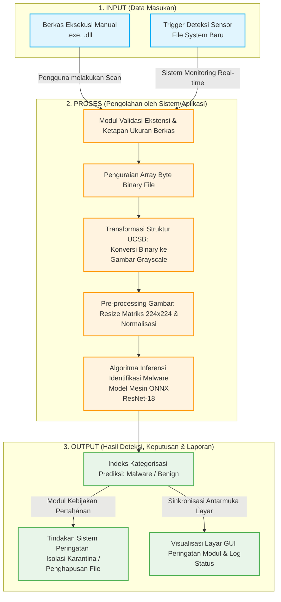

# BAB 3 - PELAKSANAAN KERJA (DRAFT)

**Judul TA**: *Pengembangan Antimalware Menggunakan Model Machine Learning CNN Dengan Representasi Gambar*

---

## 3.1 Analisis Sistem

Deteksi malware merupakan aspek kritis dalam keamanan siber. Saat ini, sebagian besar antivirus komersial masih mengandalkan metode deteksi berbasis *signature* yang mencocokkan hash atau pola byte spesifik dari file yang dipindai dengan database *signature* malware yang sudah diketahui. Metode ini efektif untuk mendeteksi malware yang sudah terdaftar, namun memiliki kelemahan fundamental yaitu ketidakmampuan mendeteksi varian malware baru (*zero-day*) yang belum memiliki *signature* di database.

Dalam penelitian ini, dikembangkan pendekatan alternatif yaitu deteksi malware menggunakan model *machine learning* CNN (*Convolutional Neural Network*) dengan representasi gambar. Pendekatan ini bekerja dengan mengonversi file binary menjadi gambar *grayscale*, kemudian mengklasifikasikan gambar tersebut menggunakan model CNN ResNet-18. Berbeda dengan deteksi berbasis *signature*, CNN mempelajari **pola visual** dari struktur binary malware sehingga mampu menggeneralisasi dan mendeteksi varian malware baru yang memiliki pola struktural serupa dengan malware yang sudah dikenali.

Berikut adalah perbandingan antara sistem deteksi yang berjalan saat ini dengan sistem yang dikembangkan:

| Aspek | Deteksi Berbasis Signature (Saat Ini) | Deteksi Berbasis CNN + Representasi Gambar (Pengembangan) |
|-------|--------------------------------------|----------------------------------------------------------|
| Metode | Mencocokkan hash/pola byte | Mengenali pola visual dari gambar binary |
| Zero-day | ❌ Tidak mampu | ✅ Mampu (generalisasi pola) |
| Update | Harus update database signature rutin | Model belajar dari pola, tidak bergantung pada signature |
| Kecepatan | Cepat (pencocokan string) | Cepat (inferensi ONNX < 3 detik) |
| False Positive | Rendah | Rendah (akurasi 98%) |
| Skalabilitas | Tergantung ukuran database | Tidak tergantung database, model tetap ringan (~42 MB) |

---

## 3.2 Pemodelan Sistem

Pada tahap perancangan sistem, dilakukan proses pemodelan sistem guna memberikan gambaran menyeluruh mengenai alur kerja, struktur, dan komponen-komponen utama dalam sistem deteksi *malware* yang akan dibangun. *(Catatan: Karena penelitian ini dikerjakan secara individu tanpa pembagian tim, blok pada sistem tidak memerlukan pemecahan batasan batas-kerja dengan garis putus-putus).*

### 3.2.1 Gambaran Umum dan Blok Diagram Sistem

Blok diagram digunakan untuk menggambarkan struktur keseluruhan sistem *antimalware* beserta interaksi komponen utamanya. Pemodelan fungsional ini direpresentasikan melalui tiga fase utama, yaitu **Input** (Masukan Sensor/Pengguna), **Proses** (Pengolahan Aplikasi), dan **Output** (Hasil Prediksi dan Tindakan).\n


**Penjelasan Alur Kerja Blok Diagram Sistem:**

1. **Input**: Sumber fasilitas gerbang pemicu yang menampung objek sasaran kecurigaan. Input ini dieksekusi melalui **dua cara**, yang pertama secara pasif (manual) oleh tangan pengguna aplikasi melalui *interface scan*, maupun secara pro-aktif mendeteksi *real-time* dari modul *Watchdog Observer* yang otomatis mencatat file baru setiap mendeteksi perubahan masuk dalam struktur penyimpanan komputer.
2. **Proses**: Tahapan sentral inti perhitungan di dalam perangkat lunak aplikasi. Sistem memulai perhitungannya dengan *whitelist* (pemberitahuan yang sah) untuk hanya menangkap kelompok file `.exe` dan `.dll`. File target lalu dibuka dan *di-ekstrak* rentetan *byte binary*-nya secara mentah. Struktur acak byte angka ini dicetak/ditransformasikan menjadi citra gambar representasi statis (gambar *grayscale*). Sesuai struktur masukan model Machine Learning pendeteksi, dimensi ukuran gambar itu kemudian ditingkatkan spesifikasinya (*resize*) menyentuh rasio baku resolusi dimensi 224x224 pixel dan di-normalisasikan agar dapat disuplai (*feed forward*) ke komputasi mesin kalkulator utama **ONNX Runtime (Jaringan CNN ResNet-18)** untuk diselesaikan klasifikasinya.
3. **Output**: Perumusan luaran sistem kesimpulan dan implementasi solusi akhir. Aplikasi memusatkan hasil ke dalam vonis kategorisasi file **Aman (*Benign*)** atau **Berbahaya/Virus (*Malware*)**. Jika divonis berbahaya, alur berlanjut menuju kebijakan penanganan mitigasi ancaman otomatis berupa menyita berkasnya (*Karantina*) atau pemusnaham (*Delete*) dari sistem ruang harddisk. Seluruh alur mitigasi ini bersama-sama juga menerbitkan dan meng-update pelaporan statis secara interaktif pada notifikasi pop-up GUI pengguna.

### 3.2.2 Flowchart Diagram Aplikasi

*Flowchart* (diagram alir bersimbol) berikut digunakan memvisualisasikan lebih detail tentang urutan langkah-langkah tata kerja fungsional dan logis penanganan satu file *step-by-step* termasuk pada pengambilan dan pencabangan keputusan di dalam aplikasi:

```mermaid
flowchart TD
    START([Mulai Eksekusi Proses]) --> GET_FILE[/Input: Terima Berkas File Sasaran/]
    GET_FILE --> CHK_VALID{Validasi/Decision:
Apakah File Memiliki
Ekstensi (.exe / .dll)?}
    
    CHK_VALID -- Tidak --> END_IGNORE([Terminasi File Selesai - Abaikan])
    CHK_VALID -- Ya --> READ_BIN[Tahap Pengerjaan: Ekstraksi Data Binary Mentah]
    
    READ_BIN --> CONV_IMG[Tahap Pengerjaan: Susun Algoritma Binary Menjadi Citra Pixels]
    CONV_IMG --> RESIZE[Tahap Pengerjaan: Pelatihan Dimensi Resolusi ke 224x224]
    RESIZE --> INFER[Tahap Pengerjaan: Feedforward Proses ke Mesin ONNX]
    
    INFER --> CHECK_MALWARE{Percabangan Prediksi:
Apakah Skor File
Melebihi Toleransi Malware?}
    
    CHECK_MALWARE -- Kasus Prediksi Aman (Benign) --> LOG_SAFE[Tahap Pengerjaan: Catat Histori Event File Valid]
    LOG_SAFE --> END_SAFE([Prosedur Scan Selesai - Aman])
    
    CHECK_MALWARE -- Kasus Terbukti Malware --> ALERT[Tahap Pengerjaan: Tampilkan GUI Alert Bahaya!]
    ALERT --> USER_CHOICE{Penanganan Ancaman:
Tindakan Pengguna
atau Respons Sistem?}
    
    USER_CHOICE -- Opsi Kurung Isolasi --> ACT_QUARANTINE[Tahap Modifikasi: Paksa Pindah File ke Lokasi Vault Karantina]
    USER_CHOICE -- Opsi Pembersihan --> ACT_DELETE[Tahap Modifikasi: Perintah Hapus Menyeluruh Target File]
    
    ACT_QUARANTINE --> NOTIF[Tahap Display: Tampilkan Output UI Pop-up Status Berhasil]
    ACT_DELETE --> NOTIF
    
    NOTIF --> END_MALWARE([Prosedur Mitigasi Selesai])
```

## 3.3 Kualitas/Kinerja Sistem

Kualitas sistem diukur melalui dua aspek utama:

### A. Kinerja Model Machine Learning

| Kriteria | Target | Cara Pengukuran |
|----------|--------|-----------------|
| Accuracy | ≥ 95% | `accuracy_score()` dari scikit-learn |
| Precision | ≥ 90% | `precision_score()` dari scikit-learn |
| Recall | ≥ 90% | `recall_score()` dari scikit-learn |
| F1-Score | ≥ 90% | `f1_score()` dari scikit-learn |
| Waktu inferensi per file | < 5 detik | Pengukuran waktu (`time.time()`) |

### B. Kinerja Aplikasi Desktop (GUI)

| Kriteria | Target | Cara Pengukuran |
|----------|--------|-----------------|
| Keberhasilan fitur | ≥ 90% skenario berhasil | Pengujian manual (*black box testing*) |
| Waktu respon scan file | < 5 detik | Stopwatch |
| Waktu navigasi antar halaman | < 1 detik | Stopwatch |
| GUI tidak freeze saat scanning | 0 kejadian freeze | Observasi manual |
| Aplikasi tidak crash | 0 crash selama pengujian | Observasi manual |

Total skenario pengujian GUI: **20 skenario** (detail di dokumen Skenario Pengujian).

---

## 3.4 Kebutuhan Perangkat Kerja

### 3.4.1 Pengembangan Sistem

#### Perangkat Keras

| Perangkat | Spesifikasi | Fungsi |
|-----------|------------|--------|
| Laptop/PC | Minimal RAM 8 GB, SSD | Pengembangan kode dan training model |
| GPU (opsional) | NVIDIA (CUDA-compatible) | Mempercepat training model CNN |
| Prosesor | Intel i5/AMD Ryzen 5 ke atas | Komputasi umum dan inferensi model |

#### Perangkat Lunak

| Perangkat Lunak | Versi | Fungsi |
|----------------|-------|--------|
| **Python** | 3.11 | Bahasa pemrograman utama |
| **PyTorch** | ≥ 2.0.0 | Training model CNN ResNet-18 |
| **torchvision** | ≥ 0.15.0 | Arsitektur ResNet-18 dan transformasi gambar |
| **PySide6** | ≥ 6.6.0 | Framework GUI desktop (Qt6 binding resmi) |
| **ONNX Runtime** | ≥ 1.16.0 | Inferensi model ONNX di desktop |
| **Pillow** | ≥ 10.0.0 | Pemrosesan gambar |
| **NumPy** | ≥ 1.24.0 | Operasi array dan matriks |
| **scikit-learn** | - | Evaluasi metrik akurasi model |
| **watchdog** | ≥ 3.0.0 | File system monitoring (real-time protection) |
| **win10toast** | ≥ 0.9 | Notifikasi desktop Windows |
| **psutil** | ≥ 5.9.0 | Monitoring resource sistem |
| **matplotlib** | ≥ 3.7.0 | Visualisasi confusion matrix |
| **Visual Studio Code** | Latest | IDE untuk penulisan kode |
| **Jupyter Notebook** | Latest | Eksplorasi data dan training model |
| **Git** | Latest | Version control |
| **PyInstaller** | ≥ 6.0.0 | Build executable (.exe) |

### 3.4.2 Implementasi Sistem

#### Perangkat Keras (Minimum)

| Perangkat | Spesifikasi Minimum | Fungsi |
|-----------|---------------------|--------|
| PC/Laptop | RAM minimal 4 GB | Menjalankan aplikasi MangoDefend |
| Penyimpanan | Minimal 200 MB tersedia | Instalasi aplikasi + model ONNX |
| Prosesor | Intel i3/AMD Ryzen 3 ke atas | Inferensi model |

#### Perangkat Lunak

| Perangkat Lunak | Versi | Fungsi |
|----------------|-------|--------|
| **Sistem Operasi** | Windows 10/11 (64-bit) | Platform target aplikasi |
| **ONNX Runtime** | ≥ 1.16.0 | Menjalankan model CNN ResNet-18 |
| **Python Runtime** | 3.11 (atau bundled via PyInstaller) | Menjalankan aplikasi |
| **Microsoft Visual C++ Redistributable** | Latest | Dependensi runtime |

---

## 3.5 Dataset

Dataset yang digunakan dalam penelitian ini terdiri dari dua kelas:

| Kelas | Deskripsi |
|-------|-----------|
| **Malware** | Sampel file malware yang telah dikonversi menjadi representasi gambar grayscale |
| **Benign** | Sampel file aman (legitimate software) yang telah dikonversi menjadi representasi gambar grayscale |

Pembagian dataset:
- **80%** untuk data *training* (pelatihan model)
- **20%** untuk data *testing* (pengujian model)

Pembagian dilakukan secara acak menggunakan fungsi `torch.utils.data.random_split()` untuk memastikan distribusi data yang representatif.
